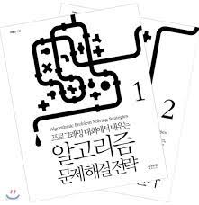

# Algorithm_Study
Endless Creation 알고리즘 part 스터디 자료들 입니다. 자세한 내용은 노션 링크를 참고해 주세요
[알고리즘 스터디 노션 기록](https://www.notion.so/3c5902e9697045a29f3ee08e20bbc236?pvs=4)

# 팀명: 원리를 Algo 풀자
### 팀장
1.  **김경태**
- [solved.ac 링크](https://solved.ac/profile/kimgt0128) 
- [블로그 링크](https://wondrous-developer.tistory.com/category/%EC%9E%90%EB%A3%8C%EA%B5%AC%EC%A1%B0%20%EC%95%8C%EA%B3%A0%EB%A6%AC%EC%A6%98) 
1. **박진홍**
- [solved.ac 링크](https://solved.ac/profile/com5942)
- [블로그 링크](https://jiinhong.github.io/)
### 팀원
 강영훈, 박수진, 김성휘, 최강, 홍준희, 최현락, 신용우, 오세현, 김강현

## 참고 자료

1. <알고리즘 문제해결전략>

    

2. [[바킹독의 실전 알고리즘] 0x00강 - 오리엔테이션](https://www.youtube.com/watch?v=LcOIobH7ues&list=PLtqbFd2VIQv4O6D6l9HcD732hdrnYb6CY)

## ✏️목표

- 꾸준한 문제 풀이를 통한 알고리즘 실력 향상
- 풀이 방법 공유를 통한 다양한 풀이 습득

## 📎방식

1. 개념과 예제 문제 풀이
대표 유형을 풀이하면서 개념을 정리한다.
2. 문제 토론
약 10분 동안 각자 풀어온 문제를 발표합니다. 이후 자신이 어디서 막혔는지 설명하고 문제의 논리 과정을 피드백합니다. 
3. 과제
다음 시간에 발표할 문제제들을 안내하고 스터디를 종료합니다.
필요에 따라 알아낸 방법이나 이해한 내용을 기록합니다.

## 📝계획

| 주차 | 내용 |
| -- | -- |
|OT | 시간 복잡도, 공간 복잡도, 기초 코드 작성 요령
|1 | 배열
|2 | 

